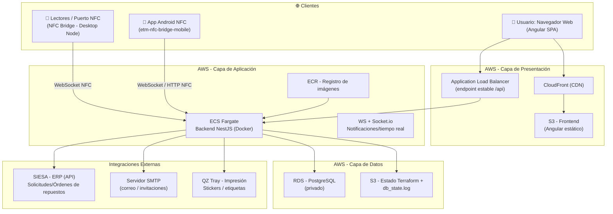
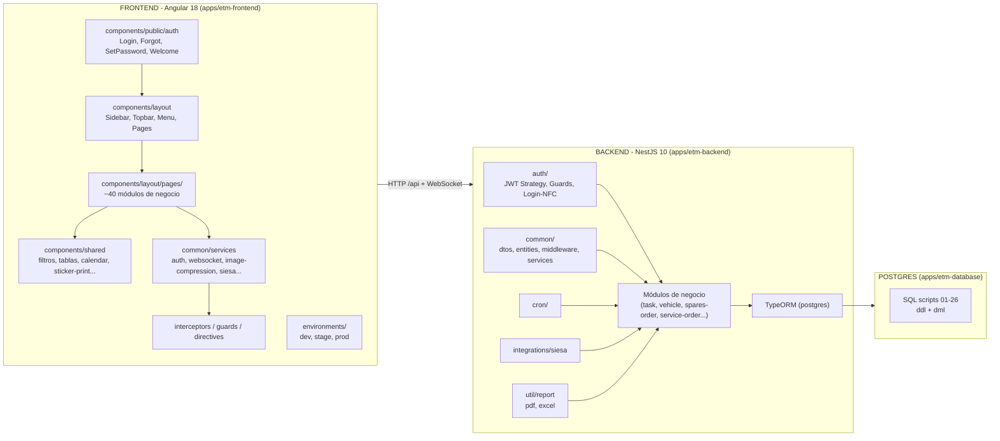
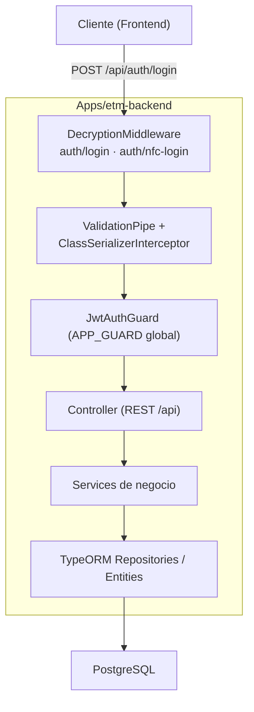
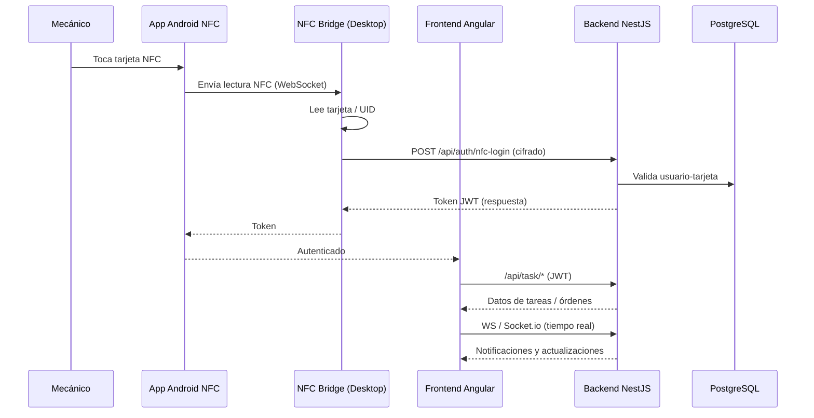
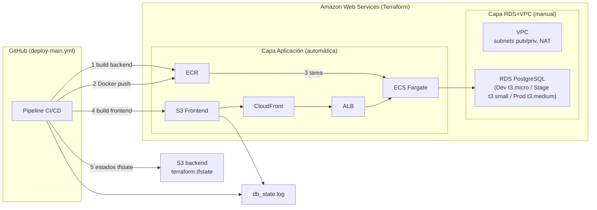
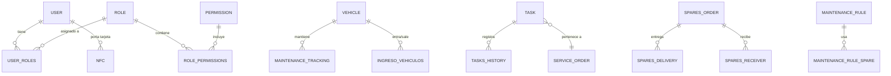

# Arquitectura ETM Core App

> Documento de arquitectura del sistema **ETM Core** (Sistema de Gestión de Mantenimiento de Flota de Vehículos). Este documento describe los componentes, diagramas, flujos y cómo replicar la estructura en un nuevo proyecto.

---

## 1. Resumen Ejecutivo

**ETM Core** es una plataforma full-stack para la gestión del mantenimiento de una flota de buses. Permite planear mantenimientos, generar órdenes de trabajo, gestionar repuestos e inventario, aprobar solicitudes (reparaciones, nuevos ítems, repuestos), y registrar la actividad de mecánicos mediante tarjetas **NFC**.

Es un **monorepo NX 21** que agrupa:

| Capa | Tecnología | App |
|------|-----------|-----|
| Frontend Web | **Angular 18** + NG-ZORRO + PrimeNG | `apps/etm-frontend` |
| Backend API | **NestJS 10** + TypeORM | `apps/etm-backend` |
| Base de datos | **PostgreSQL** | `apps/etm-database` |
| Puente NFC (desktop) | **Node.js** + WebSocket + tarjetas | `apps/etm-nfc-bridge` |
| Lectura NFC (móvil) | **Android / Kotlin** | `apps/etm-nfc-bridge-mobile` |
| CI/CD + Infra | **GitHub Actions + Terraform / AWS** | `scripts/` |

---

## 2. Diagrama de Arquitectura General



---

## 3. Diagrama de Arquitectura por Capas (Backend + Frontend)



---

## 4. Diagrama de Componentes del Backend



**Notas clave del backend:**
- Prefijo global: `/api`
- Guard de autenticación JWT **global** (`APP_GUARD`) — todas las rutas protegidas salvo las públicas.
- Middleware de cifrado/descifrado en login (`DecryptionMiddleware`).
- `ValidationPipe` estricto (`whitelist`, `forbidNonWhitelisted`, transform).
- Body limit 50mb (para imágenes en Base64).
- `synchronize: false` → las migraciones se controlan con scripts SQL / TypeORM migrations.
- WebSockets + Socket.io para notificaciones en tiempo real.

---

## 5. Diagrama de Flujo con NFC



---

## 6. Diagrama de Despliegue (AWS + CI/CD)



**Ramas → Entornos:**
- `main` → **prod**
- `stage` → **stage**
- otras → **dev**

**Pipeline (GitHub Actions):**
1. Deploy infraestructura (`scripts/infra`)
2. Deploy base de datos (`apps/etm-database`)
3. Deploy backend (Docker → ECR → ECS)
4. Deploy frontend (build → S3 sync → CloudFront invalidation)

---

## 7. Diagrama de la Base de Datos (módulos principales)



> Los scripts SQL se encuentran versionados en `apps/etm-database/sql_scripts/01-26` (DDL de creación de tablas + DML de datos semilla e índices de rendimiento).

---

## 8. Estructura de Carpetas (para replicar en otro proyecto)

### 8.1 Raíz del monorepo

```txt
etm-core-app/
├── package.json              # NX 21 · Angular 18 · NestJS 10
├── nx.json
├── tsconfig.base.json
├── eslint.config.js / jest.config.ts / jest.preset.js
├── dockerfile / entrypoint.sh / DOCKER.md
├── .env / .gitignore / README.md
├── apps/
└── scripts/
```

### 8.2 Apps

```txt
apps/
├── etm-backend/                  # NestJS + TypeORM + PostgreSQL
│   ├── src/
│   │   ├── main.ts
│   │   ├── app.module.ts         # importa ~40 módulos + TypeORM
│   │   ├── typeorm.config.ts
│   │   ├── assets/
│   │   └── app/
│   │       ├── auth/             # decorators, dtos, entities, guards,
│   │       │                     #   services, strategies, utils
│   │       ├── common/           # config, constants, dtos, entities,
│   │       │                     #   interfaces, middleware, services
│   │       ├── cron/
│   │       ├── config/
│   │       ├── excel/
│   │       ├── integrations/siesa/
│   │       ├── util/report/      # pdf, excel
│   │       └── <dominio>/*       # cada: *.module.ts, *.controller.ts,
│   │                             #   *.service.ts, entities/, dtos/, interfaces/
│   ├── migrations/
│   ├── project.json
│   └── tsconfig*.json
│
├── etm-frontend/                 # Angular 18 SPA
│   ├── src/
│   │   ├── main.ts, app.routes.ts, app.config.ts
│   │   ├── environments/         # env.ts, .dev, .stage, .prod
│   │   ├── assets/               # styles, themes, qz-certs
│   │   └── app/
│   │       ├── common/           # components, config, constants, enums,
│   │       │                     #   interfaces, services, utils
│   │       ├── components/
│   │       │   ├── layout/       # sidebar, topbar, menu, nfc-session-overlay
│   │       │   │   └── pages/    # <página>/{constants, interfaces, services}
│   │       │   ├── public/auth/  # login, set-password, welcome...
│   │       │   └── shared/       # filter, simple-table, sticker-print...
│   │       ├── directives/ guards/ interceptors/ model/ service/ utils/
│   ├── public/
│   └── project.json
│
├── etm-database/                 # SQL PostgreSQL
│   ├── sql_scripts/              # 01-26: DDL + DML versionados
│   ├── env/{dev,stage,prod}.sh
│   ├── connect.sh / createDatabase.sh
│   └── README.md
│
├── etm-nfc-bridge/               # Puente NFC desktop (Node.js)
│   ├── src/                      # index, nfc-reader, nfc-worker,
│   │                             #   websocket-server, service-installer,
│   │                             #   nfc-mac.py, nfc-winscard.ps1
│   └── scripts/
│
└── etm-nfc-bridge-mobile/        # App Android NFC (Kotlin/Gradle)
    └── app/src/
```

### 8.3 Scripts / Infra

```txt
scripts/
├── infra/                        # Terraform AWS - Aplicación
│   ├── provider.tf, variables.tf, outputs.tf
│   ├── vpc.tf, securityGroups.tf, s3.tf, cloudfront.tf
│   ├── ecr.tf, alb.tf, ecs.tf, ecsService.tf
│   └── environments/{dev,stage,prod}/env.tfvars
├── rds/                          # Terraform AWS - Base de datos
│   ├── rds.tf, vpc.tf, s3.tf, outputs.tf, variables.tf
│   └── environments/{dev,stage,prod}/env.tfvars
└── dev-proxy/
```

---

## 9. Patrón por Módulo (receta para agregar funcionalidad)

### Backend — agregar un módulo de dominio
1. Crear carpeta `apps/etm-backend/src/app/<dominio>/` con:
   - `<dominio>.module.ts` → registra controller + service + TypeOrmModule.forFeature([Entity])
   - `<dominio>.controller.ts` → rutas REST bajo `/api/<dominio>`
   - `<dominio>.service.ts` → lógica de negocio
   - `entities/` → entidades TypeORM
   - `dtos/`, `interfaces/`, `enums/`
2. Importar el módulo en `app.module.ts`.

### Frontend — agregar una página
1. Crear `apps/etm-frontend/src/app/components/layout/pages/<página>/` con:
   - `<página>.component.ts/.html/.scss/.spec.ts`
   - `constants/` (mensajes/opciones)
   - `inputs-table-config/` (configuración de tablas)
   - `interfaces/`, `services/`
2. Registrar la ruta en `app.routes.ts`.

---

## 10. Comandos Útiles

| Comando | Descripción |
|---------|-------------|
| `nx serve etm-frontend` | Levanta frontend (dev) |
| `nx serve etm-backend` | Levanta backend (dev) |
| `nx build etm-frontend` | Compila frontend |
| `nx build etm-backend` | Compila backend |
| `nx test etm-frontend` / `nx test etm-backend` | Tests |
| `npm run typeorm:run` | Ejecuta migraciones TypeORM |
| `npm run apply --env=dev` | Aplica infraestructura dev (Terraform) |
| `npm run rds:apply --env=dev` | Aplica RDS dev |

---

## 11. Variables de Entorno Principales

| Grupo | Variables |
|-------|-----------|
| Base de datos | `DB_HOST`, `DB_PORT`, `DB_NAME`, `DB_USERNAME`, `DB_PASSWORD`, `DB_SCHEMA`, `DB_SSL` |
| Aplicación | `NODE_ENV`, `PORT`, `TZ` |
| Autenticación | `JWT_ACCESS_SECRET`, `JWT_REFRESH_SECRET`, `PASSWORD_RESET_MINUTES`, `PASSWORD_INVITE_MINUTES` |
| Correo | `FRONT_BASE_URL`, `SMTP_HOST`, `SMTP_PORT`, `SMTP_SECURE`, `SMTP_USER`, `SMTP_PASS`, `MAIL_FROM` |
| Integración SIESA | `SIESA_CONNIKEY`, `SIESA_CONNITOKEN`, `SIESA_COMPANY_ID`, `BASE_URL`, `BASE_URL_POST`, etc. |
| Frontend | `apiBaseUrl`, `baseUrl`, `websocketUrl`, `production`, `withCredentials` |

---

*Documento generado a partir del repositorio `etm-core-app`. Para más detalle: `docs/DEPLOYMENT_FLOW.md`, `scripts/infra/INFRASTRUCTURE.md`, `DOCKER.md`.*
